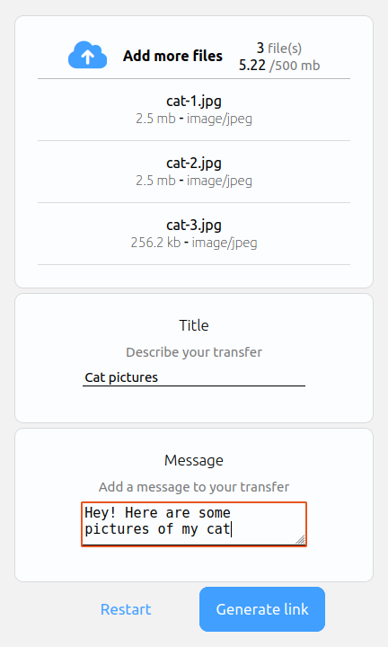
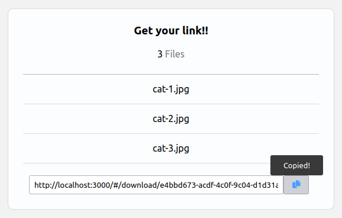
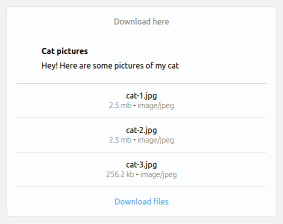

# FileTransfer

Share your files effortlessly with FileTransfer. Built for quick file sharing with no account creation hassle or 
emailing.  
[FileTransfer app](https://file-transferx.herokuapp.com)

## How to use 

### Step 1:
Click or drag n drop to the first box to upload the desired file(s). 
 Add a title to your transfer and an optional message.

### Step 2:
Press the "Generate link" button after dropping in all desired file(s) and it will upload them to the cloud for quick retrieval.

Restarting the process can be done by
pressing "Restart" or by refreshing the browser.

### Step 3:
Copy the generated download link using the blue copy button

### Step 4:
Share this link with anybody to download your file(s)!

